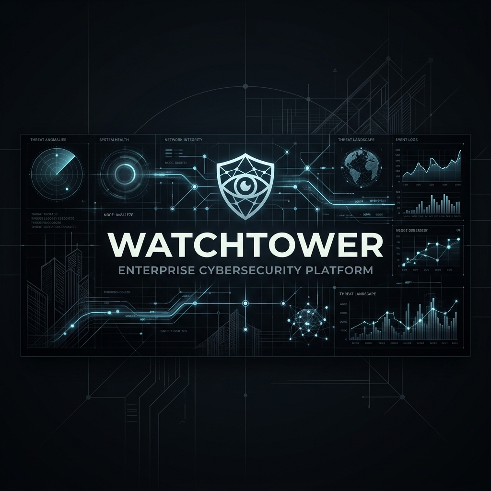

# Watchtower Sovereign EDR/NDR (v1.6.9 Architecture)



[](LICENSE)
[](SECURITY.md)
[](tools.md)
[](mailto:watchtowerprotocol@proton.me)

**Watchtower Command** is a fundamentally autonomous, zero-dependency Network Detection & Response (NDR) platform. It is engineered explicitly from the ground up for **Agentic Setup**—you can literally hand this entire repository to an autonomous AI agent or orchestration framework (like OpenClaw, Hermes, SWE-Agent, or AutoGPT) and instruct it to install, configure, and operate the entire cybersecurity platform autonomously for you. Welcome to Watchtower. This is a commercial-grade, locally-hosted Sovereign Security platform. It transforms any host (Windows OS, Apple Silicon, Linux VPS, or Raspberry Pi) into an AI-powered Threat Hunting Gateway.

## 🛑 What Does Watchtower Replace?
Watchtower is designed to replace expensive, cloud-dependent, per-endpoint licensed security stacks. By running your own open-source models (or utilizing cloud APIs on your terms), Watchtower replaces:

*   **Commercial EDRs (CrowdStrike, SentinelOne):** Replaced by Watchtower's Behavioral Engine, Regex Sweeper, and Auto-Rollback features.
*   **Network Detection (Darktrace, Vectra):** Replaced by Watchtower's NDR anomaly detection, subnet mappers, and lateral movement monitors.
*   **Data Loss Prevention (Varonis, Symantec DLP):** Replaced by Watchtower's FIM, Decoy USB traps, and Native Crypto Guard (Seed phrase/wallet protection).
*   **SIEMs (Splunk, Datadog Security):** Replaced by Watchtower's centralized Hub dashboard and LLM-driven log correlation.

## 🦅 The Sovereign Advantage (Why this matters)
Legacy EDRs stream your entire company's file metadata, process executions, and network telemetry to their proprietary cloud servers. 
Watchtower is a **Sovereign Matrix**. 
1. **Zero Exfiltration:** Your telemetry never leaves your network. 
2. **AI-Operated, Not Just AI-Assisted:** Legacy tools give alerts to a human SOC analyst. Watchtower gives tools natively to an LLM, allowing the AI to autonomously hunt, quarantine, and isolate threats in real-time.
3. **Zero-Dependency:** Nodes do not require heavy agents, JVMs, or complex dependencies. Pure, lightweight subprocesses.

## 1. What does it do?
Watchtower acts as a fully enclosed, autonomous Central System spanning multi-OS networks. The centralized **Hub** hosts the AI-Driven telemetry portal and Fleet Asset Tracker, while distributed **Supervisors** (Beacons) autonomously enforce Security Policies, trace behavioral fileless memories, and intelligently hunt zero-days locally natively via Python subprocesses.

## 2. Dynamic Host Group Administration
Unlike legacy systems relying on `.env` modifications or static shell scripts, Watchtower implements **Centralized Group Policies**.

1. **Dashboard Configuration**: From the `localhost:8080` Admin Dashboard, you can dynamically create deployment umbrellas (e.g., `Prod Tier 1`, `Laptops`, `Default`).
2. **Toggle Subsystems Natively**: Enable specific combinations of AI Sensors (`Behavior Engine`, `Deep Oracle`, `FIM`, `Regex Memory Sweeper`, `NDR Engine`, `CIS Compliance`, `Auto-Rollback`, or `Audit Mode`).
3. **Instant Phased-Rollout**: When configured, the Hub reaches out to enrolled endpoints and seamlessly toggles internal Python processes instantly without disrupting OS services.
4. **OTA Network Upgrades**: Securely patch your mesh nodes instantly by navigating to the **🚀 Deploy OTA** module, uploading a `core.zip`, and watching endpoints natively parse your cryptographic HMAC deployment payload globally over internal tailscale IP blocks.

## 3. Distributed Installation Wizard

Watchtower ships with an intelligent Terminal Onboarding interface. To natively configure an endpoint or your main console, execute:

```bash
chmod +x setup.sh
./setup.sh
```

**The Setup Engine will prompt you to seamlessly deploy either:**
1. **Master Hub Mode**: Automatically downloads `Node.js` GUI frameworks, sets up the web dashboard, and generates secure JSON Web Tokens natively into `.env`.
2. **Edge Sensor Mode**: Deploys purely as a lightweight intelligence beacon, dropping all heavy web dependencies. It natively hooks outwards binding securely back to your configured Master Hub.

## 4. Hardware Integrations (Qwen, Llama, OpenAI, Anthropic)
Watchtower operates flawlessly on edge silicon or Cloud interfaces. It seamlessly decodes API signals from massive offline logic models (like Qwen, Llama, or Gemma) as well as commercial cloud APIs. For optimized EDR reasoning, guarantee your `max_tokens` context buffers evaluate up to `4000` tokens, allowing complex chain-of-thought isolation against file entropy variants.

## 5. Defense Mechanics
*   **Behavioral Engine:** Halts Living-off-the-Land memory drops.
*   **Asset App Tracker:** Live-streams full SBOM usage pipelines metrics onto the matrix layout.
*   **Decoys/USB-DLP:** Automatically counters physical extraction vectors and lateral ransom sweeps. 
*   **Zero-Day Revocation:** Continuously integrates Hacker News Zero-Day reports with localized App inventory to isolate binaries instantly before CVE disclosures.
*   **Memory Signatures (Regex Sweeper):** Scans active disk executables via zero-dependency pure Python regex arrays for Cobalt Strike or Metasploit.
*   **Auto-Rollback (Snapshots):** Generates active VSS/APFS shadow-copies to immunize nodes against Ransomware encryption bursts dynamically (Requires Windows Administrator Elevation).
*   **Zero-Trust CIS Auditor:** Routine cross-OS assertions assessing firewall, encryption, and sshd constraints strictly alerting via telemetry.
